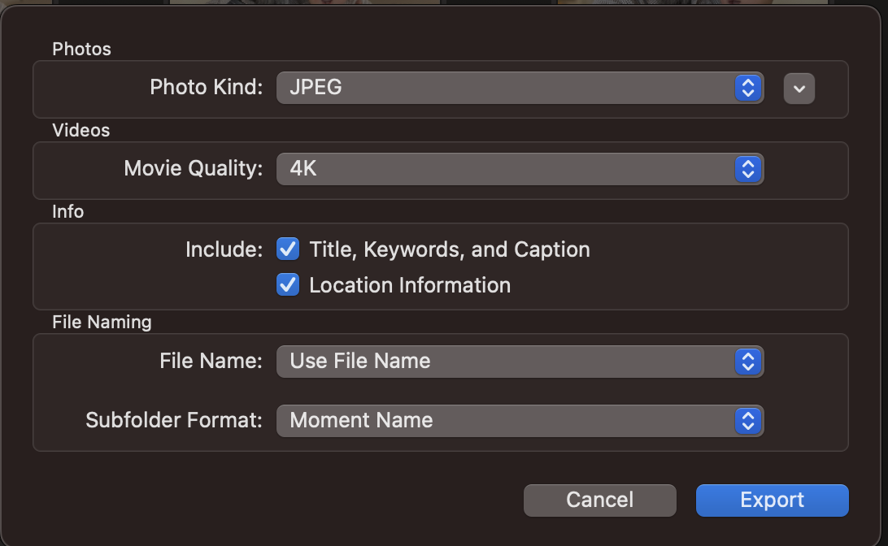
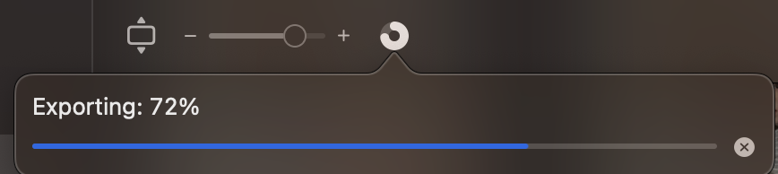

It took me a few attempts to figure out a good way to backup photos from an iPhone and Macbook to a proper format on an external NAS, so I figured I'd write it down.

First, import all the photos from your iPhone(s) onto the Macbook. This should put them in your local Photos library, and will probably start tagging them with "Memories" and location information.

Once all the photos are imported into the Photos app, go to the "Library" tab on the left. Select all of the photos with Edit -> Select All or (CMD + A). Then export all the photos by going to File -> Export -> Export # Items ( not the unmodified option, this will export in the original HEIC format that is useless outside of a Mac ).

In the export prompt, select the following options:

* Image Kind: `JPEG`
* Movie Quality: `4K`
* Include:
    * [x] Title, Keywords, Caption
    * [x] Location Information
* File Name: `Use File Name`
* Subfolder Format: `Moment Name`

I pick a local folder on my desktop for the initial export, to double check the formats and naming convention and then copy it over to the external network storage.

You can check the progress of the export in the Photos app, next to the zoom slider.

