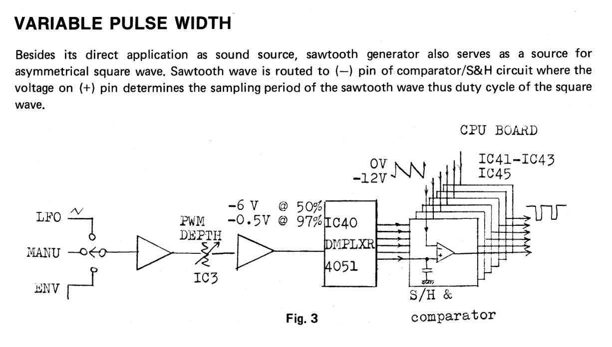
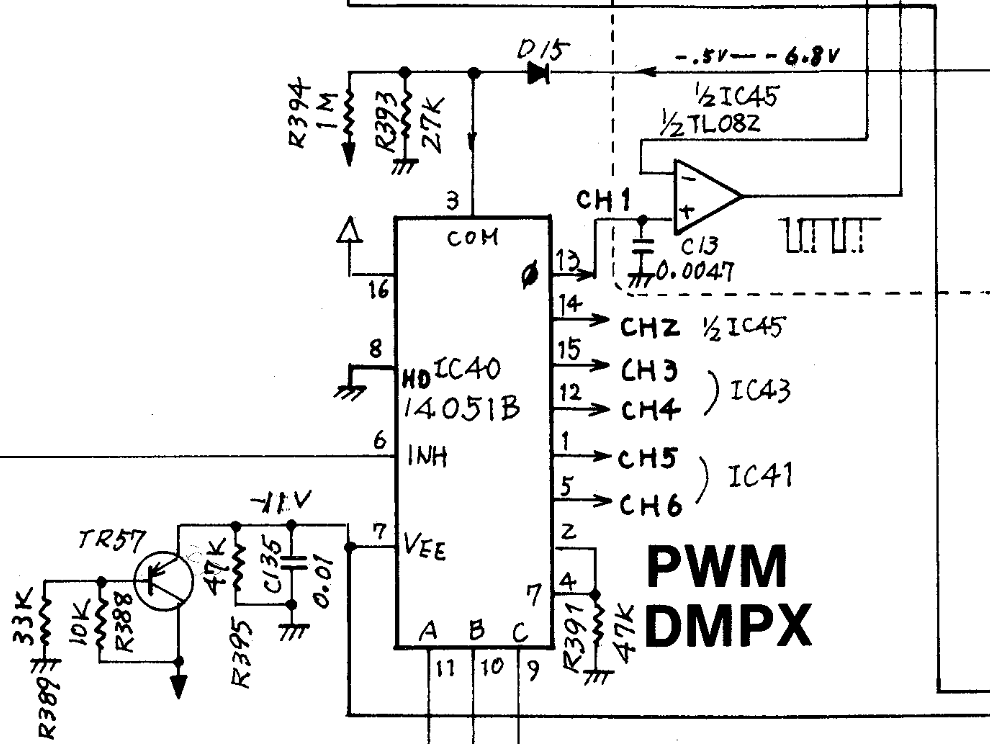

I've finally gotten around to starting, and finishing, some long overdue repairs to my Roland Juno 6.

When I purchased the synth, it had a broken bender lever. This is a pretty common thing and replacements can be found fairly cheaply - I purchased mine from [Syntaur](https://syntaur.com/Part-4023-Bender-lever-Roland). It also had a missing slider cap at the time, which I also found a replacement for from [Syntaur](https://syntaur.com/Part-4367-Slider-knob-Roland).

After owning the synth for a while, I discovered that the PWM control was non-functional. This meant that the pulse wave oscillator was stuck at a certain duty cycle regardless of LFO or manual control of the PWM. Years ago I attempted a fix by simply replacing the entire panel PCB that contained the PWM controls, this didn't work, and I just left it for several more years.

At some point, probably just after I finished refurbishing and calibrating a Juno 60 that I sold, I took a closer look at the PWM control circuit. I noticed that beyond the front panel controls there was a 4051 multiplexer being used as a de-multiplexer.

The service manual gives a nice description of this circuit which lead me to look at this chip initially. ( This ultimately prompted me to buy a [replacement 4051](https://syntaur.com/Part-4319-IC-4051-multiplexer-chip) back in 2019, as I suspected it to be a likely culprit. )

I first measured the input CV on pin 3, I found that it was changing as expected between `-.5V` and `-6.8V` as I changed the front panel PWM slider.

I then measured a couple of the output pins and there was a distinct sawtooth waveform but it had a fair amount of noise to it and was unaffected by the front panel control changes. I also confirmed at TR2 of a couple of the voices that the resulting pulse wave was unchanged while moving the PWM slider. 

With this evidence I went ahead and replaced the 4051 with the chip I had purchased previously. After replacement I again checked TR2 and confirmed that the pulse duty cycle WAS in fact changing with the front panel changes! I did a quick calibration per the service manual, up to the chorus bias section and buttoned it back up. 

I'll revisit the chorus chips and do a front panel overhaul at a later date, I wanted to jam.

In hindsight this was a very simple repair, I'm not sure what took me so long. I ordered parts to perform these repairs three years ago!

| Item Number | Description               | Price | Quantity | Amount |
| ----------- | ------------------------- | ----- | -------- | ------ |
| 4023        | Bender lever, Roland      | 16.95 | 1        | $16.95 |
| 4367        | Slider knob, Roland       | 4.95  | 1        | $4.95  |
| 4319        | IC, 4051 multiplexer chip | 2.95  | 1        | $2.95  |

