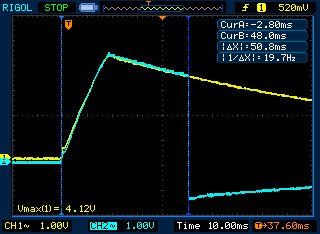

Jupiter 6 w/ Europa fails to boot, shows code F6.

Opened it up, reseated all connectors around main boards and problem went away.

Will revist at another time, if its working, its working.

### Update October 23, 2022

The JP-6 was acting up again tonight. At this point I think I'll contact [BellToneSynthWorks](https://belltonesynthworks.com/contact/) in Philadelphia, PA to see if they can help. Before I do that I want to collect my notes on previous attempts to address the issues that have been plaguing this synth since I bought it.

I found an old [VSE thread](https://forum.vintagesynth.com/viewtopic.php?t=96637#p787192) from 12/09/2016 where I was taking a look at the reset circuit in the synth. In the end it seemed the reset was working as it should, but I'm going to copy some excerpts here because some of the pictures are already gone from the thread.

> My Jupiter 6 won't boot sometimes. In checking the CPU reset circuit I found that the duration of the on time is only about 35-40ms. The service notes say that this time should be about 80ms, is this true? Their picture shows the ramp up taking ~20ms and the ON time ~80ms. My whole cycle is done in ~50-55ms.

>  I've replaced C33 and C43 and while the reset duration is a more consistent 40ms ON time. Overall it still seems short, so what else could cause this? OR am I looking in the wrong place?

__Reset Signal Scoped__

Other similar threads:

* [Jupiter 6 filter chip failure?](https://forum.vintagesynth.com/viewtopic.php?f=5&t=63476&p=636462#p635698)
    * Post by sqweebking » Mon Aug 01, 2011 10:58 pm
* [My Jupiter 6 seems like its dying..](https://forum.vintagesynth.com/viewtopic.php?f=5&t=75555&p=725836#p725836)
    * Post by sqweebking » Wed May 14, 2014 3:54 pm
* [Remove Europa from Jupiter 6](https://forum.vintagesynth.com/viewtopic.php?f=5&t=96551&p=787025#p786760)
    * Post by sqweebking » Mon Nov 28, 2016 4:37 pm
* [Need help with Jupiter 6 CPU reset circuit](https://forum.vintagesynth.com/viewtopic.php?f=5&t=96637&p=787223#p787192)
    * Post by sqweebking » Fri Dec 09, 2016 3:29 am
* [my jupiter 6 is having pretty weird issues](https://gearspace.com/board/electronic-music-instruments-and-electronic-music-production/653154-my-jupiter-6-having-pretty-weird-issues.html)
    * 29th September 2011
* [Sickly Jupiter-6; thoughts?](https://gearspace.com/board/electronic-music-instruments-and-electronic-music-production/1235196-sickly-jupiter-6-thoughts.html)
    * 21st October 2018
* [Jupiter 6 Frozen](https://gearspace.com/board/electronic-music-instruments-and-electronic-music-production/1265717-jupiter-6-frozen.html)
    * 21st May 2019 

### Update November 3, 2022

I was reading through the threads above and the this one stuck out to me - [Sickly Jupiter-6; thoughts?](https://gearspace.com/board/electronic-music-instruments-and-electronic-music-production/1235196-sickly-jupiter-6-thoughts.html). The issues reported by "eruptionchaser" sound almost identical to the behaviors of my JP6.

> It has the Europa mod, and the fault is intermittent; a fair bit of the time, it works and plays beautifully. Intermittently, it shows the following symptoms:
>
>  - it goes out of tune
>  - one or two voices stop sounding, or buzz and click
>  - pressing the 'tune' button locks the instrument up
>  - rebooting produces a Europa F6 error which means 'voice board not responding to controller'
>  - rebooting into Roland firmware by holding down the 'tape' button often, but not always, works - sometimes that reboot produces a frozen instrument.
>  - leaving it a while, perhaps overnight, after one of these episodes generally results in it rebooting normally.

A user who goes by "Synthbuilder" replies, mentioning that there are several components used in the JP6 which tend to slowly degrade and prone to fail. They suggest to replace several transistors ( to address some noise ) and to replace the orange polystyrene capacitors in the VCO and VCF circuits, stating that these are prone to intermittent failure and can cause issues during the auto tune procedure. 

> I believe there are also the same transistors on the CPU board, as well as three PNP devices on each of the voice cards which deal with the VCO balance VCAs.

> You can replace the NPNs with BC182L and the PNPs with BC212L. Take care to match the pin out from the old devices with the new ones. For the PSU the new devices can just match up with the legend on the PCB.

> If your JP-6 has orange polystyrene capacitors (four for each filter, and one for each VCO) these too can intermittently fail. The VCO ones can cause Autotune to fail as well as silencing the VCO completely. The VCF ones tend to make the filter noisy before finally making the voice fail completely. The capacitors can be replaced by 5mm C0G ceramic capacitors of the same value as the original devices. 330pF and 1nF for the VCF and VCO respectively. If one of the capacitors has failed you may as well replace all of them.

I'm going to have a look at these caps in my synth to determine if they are 1) still original and 2) can be easily measured for their performance. I'm less concerned about the transistor replacements at the moment, since when my synth is working I have not noticed any noise.

A couple other users in the thread have reported cap replacement solving similar issues for them, so I think it may be a decent thing to check.

[Go to repair attempt post](/blog/jupiter-6-repairs-2022).