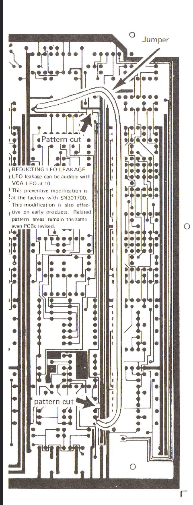
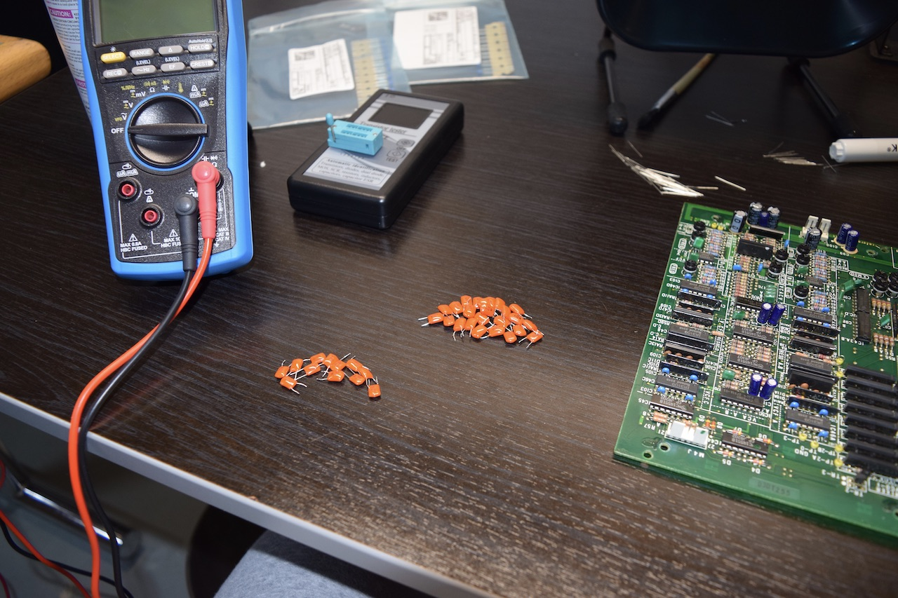

I've begun to address the [issues](/blog/jupiter-6-issues-2022) with my Jupiter 6 so I figured I'd start a new post specific to this repair attempt. 

Also to note, the serial number of this synth is 322280, making it one of the later runs as far as the notes in the service manual suggest. It was previously sold or serviced by Pi Keyboards & Audio Inc in Cleveland Ohio (216)-741-2211. ~~I'll have to try contacting them to see if they still have a record of what was done previously.~~ Looks like they're gone, possibly went out of business in 1992. 

Since I had already confirmed the PSU and all the power rails to be within spec, I decided to move forward with replacing these apparently problematic capacitors.

I bought replacement ceramic caps from Digi-Key to replace the orange polystyrene caps in the VCO and VCF circuits.

[Digi-Key Replacement Caps CSV](digikey-caps.csv)

Here are the locations of these caps on the 2 and 4 voice boards within the JP6:

__Two Voice Board__

__Four Voice Board__

## Factory Board Mods

Once I had the voice boards out I found there had been a couple, apparently factory, board modifications made. The [service manual](https://www.synthxl.com/wp-content/uploads/2018/02/Roland-Jupiter-6-jp6-Service-Manual.pdf) describes a "Reducting LFO leakage" countermeasure where a trace is cut and bypassed with a piece of wire.

> LFO leakage can be audible with VCA LFO at 10. 
> This preventative modification is at the factory with SN 301700. This modification is also effective on early products.
> Related pattern areas remain the same, even PCBs revised.

__Two Voice Board Mods__

__Four Voice Board Mods__

The second board modification was a 330Ω resistor between pin 9 of IC16 and pin 4 of IC23 (2v and 4v) and pin 9 of IC18 and pin 4 of IC25 (4v). The 4 voice board also has a jumper on VCO 2 between pin 1 of RA-5A and pin 10 of IC36A (CEM 3340).

## Replacing the caps

Removing the old caps from these boards was a little tricky, it took a combination of vacuum de-soldering and solder wicking braid to get them out. I had to be especially careful in the VCO section as the board is pretty densely populated with parts literally touching each other. There are also the original CEM 3340 VCO chips in this section that I had to be careful not to overheat. Overall it took about 3hrs to get all the old caps out and get the pads cleaned up in prep for soldering the new caps in. I managed to get them all removed w/o damaging any of the reportedly fragile solder pads, which was great.

I tested every one of the old caps as I pulled them out, they all tested within spec...but maybe they do fail intermittently or under load. /shrug

## Calibration

After replacing the caps and reinstalling the voice boards I performed a full calibration of the JP6. Since this is a Europa mod JP6, in order to get it into "JIG" mode for calibration, you have to boot it into Roland code first.

1. Start with JP6 powered OFF.
2. Set the JIG switch on the main CPU board to "JIG".
3. Power switch ON.
4. Set the JIG switch to "NORM" and then back to "JIG".

THEN you can select calibration programs as required by the service manual.

Once I located the calibration process test points and scope settings, everything was a breeze to calibrate. I had no issues getting things back within spec, the DC balance was a little wonky but ultimately I think I got it set as good as it gets.

Thankfully, [Bell Tone Synth Works had some notes](https://belltonesynthworks.com/2017/05/09/roland-jupiter-6/) on calibrating this synth, that helped me get going and confirm some suspicions along the way. The tests that suggest using the output jack or some random resistor on the JACK board are silly. There is a clearly marked OUT and GND on the voice boards where you can perform those tests without a ton of extra noise.

> When you are doing filter calibrations, use the test point on the upper left corner of the module board that is labeled “OUT.” It works much better than using the main output as the service manual for the other versions suggests; the main output seems to have a lot of supersonic noise on it that will make it hard to read the scope.

> Use test points 2A and 2B for pulse waveform adjustments. They will be almost impossible to do from the output, as the manual once again suggests.

> Also, I saw several posts from people saying that they were reading voltages like 3-4V on the DA offset test points (where it should be very close to 0 V) even though everything else seemed to be working normally.  I will admit that the reason I was reading these posts is that I myself was briefly confused. But the DA offset test points will not read 0V until you switch the synth over to test mode by moving the tiny switch on the center of the left edge of the CPU board to the “Jig” position, and THEN load program A1.  They do NOT read 0V normally.

## Testing

Firstly, the synth still has some work left on it - for sure. I didn't actually solve all of its problems yet, but its symptoms definitely seem improved. I still have a little buttoning up to do with zip ties and maybe some new PSU caps and *maybe* some new slider dust covers.

Otherwise, I haven't encountered the Europa F6 boot failure code again yet. The synth plays and sounds great as I'd expect but it does still fail to boot if you turn it off and back on "a little too quickly". I think there may still be some caps around the main CPU or PSU that need checking...

[Go to issues post.](/blog/jupiter-6-issues-2022)

[Top](#top)
