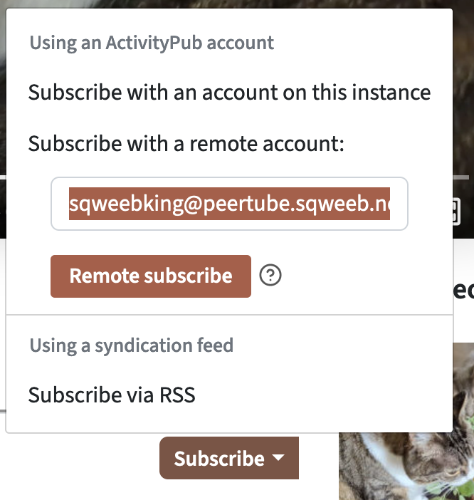

The "Fediverse" migration continues - after trying out [Mastodon](https://universeodon.com/@sqweebking) for "micro blogging", I figured I'd try out [PeerTube](https://joinpeertube.org/) for my synthesizer jam videos, etc. My server and local videos will be hosted @ [https://peertube.sqweeb.net](https://peertube.sqweeb.net/videos/local).


The PeerTube [documentation](https://docs.joinpeertube.org/install-docker) has a pretty good starting point for hosting via Docker and docker compose - I started with that. The `docker-compose.yml` file example they give you comes with a separate web server and "cert bot" container for managing SSL/TLS certificates with LetsEncrypt. I decided to use my existing [Traefik](https://traefik.io/) [setup](https://github.com/mikeder/homelab/tree/main/traefik) for proxy and certificate management instead.

My full implementation can be found in my [homelab repo](https://github.com/mikeder/homelab/tree/main/peertube).

## Modify Compose for Traefik v2

Follow the PeerTube [documentation](https://docs.joinpeertube.org/install-docker) for Docker up to the "Tweak the `docker-compose.yml` file according to your needs" section.

1. Remove the `webserver` and `certbot` container sections from the provided compose file, they will be replaced by Traefik. Remove the now unused `certbot-www` volume from the `volumes` block at the bottom too.

1. Remove the host port mappings for the `peertube` container:

    ```yaml
    ports:
        - "1935" # Comment if you don't want to use the live feature
        - "9000" # Uncomment if you use another webserver/proxy ( Traefik )
    ```

1. Add the necessary Traefik labels to the `peertube` container definition:

    ```yaml
    labels:
        # enable traefik ingress
        - traefik.enable=true
        - traefik.http.services.peertube.loadbalancer.server.port=9000 # tell Traefik to use port 9000 for web server load balancing

        # http web ui
        - traefik.http.routers.peertube-http.entrypoints=http
        - traefik.http.routers.peertube-http.rule=Host(`peertube.sqweeb.net`)
        - traefik.http.routers.peertube-http.middlewares=redirect-https # redirect http to https

        # https web ui
        - traefik.http.routers.peertube-https.tls=true
        - traefik.http.routers.peertube-https.entrypoints=https
        - traefik.http.routers.peertube-https.tls.certresolver=letsencrypt
        - traefik.http.routers.peertube-https.rule=Host(`peertube.sqweeb.net`)
    ```

1. Update the network block to make use of the pre-existing `proxy` network that Traefik uses to expose services to the web:

    ```yaml
    networks:
        proxy:
            ipv4_address: 172.19.0.42 # CIDR updated to match proxy network
    ```

1. Add the `proxy` network to the other containers in the stack so the `peertube` container can still communicate with them. If this is skipped it will not be able to locate the other containers by their name in the compose file. Ideally, the dependency containers would be in a separate "private" network outside of the "proxy" network but I didn't feel like taking the time to do this just yet. Only the services with appropriate `traefik` labels will be exposed anyway.

    ```yaml
    postgres:
        image: postgres:13-alpine
        networks:
            - proxy
        env_file:
            - .env
        volumes:
            - ./docker-volume/db:/var/lib/postgresql/data
        restart: "always"
    ```

1. Add the `proxy` network as an external network to the compose stack:

    ```yaml
        networks:
            proxy:
                external: true
    ```

Full `docker-compose.yml` file can be found [here](https://github.com/mikeder/homelab/blob/main/peertube/docker-compose.yml)

## Modify .env file for Traefik

There aren't necessarily Traefik specific changes in the `.env` file but I did want to mention that there are two config options that should remain commented out for this implementation:

```ini
# If you just want to test PeerTube on local
# PEERTUBE_WEBSERVER_PORT=9000
# PEERTUBE_WEBSERVER_HTTPS=false
```

If `PEERTUBE_WEBSERVER_PORT` is uncommented, something I did originally, the PeerTube front end will expect to make requests to `HOSTNAME:9000` instead of just `HOSTNAME` and will result in some scary "Failure to get oauth client ID..." type errors. 

When using Traefik I just had to configure the various hostname settings to match the Traefik HTTP router rules in the compose file: `peertube.sqweeb.net` and everything worked beautifully. 

## First login and configuration

Follow the PeerTube documentation to retrieve the admin/root credentials from the `peertube` container and then login to the web UI to perform some configuration.

The main configuration I enabled was "Allow import with HTTP URL" and "Allow channel synchronization with channel of other platforms like YouTube".

Administration -> Configuration -> Basic


After the basic configuration, I setup a non-root user to start uploading videos to the instance.

## Migrate videos from YouTube

Login as the new non-root user and click the "Publish" button. Since we have done the import/sync configuration in the admin panel there will be an import tab for "Import with URL", this page also links to a remote channel synchronization option in your video library.


You can check on the status of the sync and import by navigating to the "My Imports" page and expanding individual videos.


## Following Other People/Servers

I [added my instance](https://instances.joinpeertube.org/instances/add) to the public [PeerTube instance list](https://instances.joinpeertube.org/instances), this will make the server, and the public videos on it, discoverable by other people and servers.

As a user on my server I can subscribe to other users on different servers by performing a "remote subscription". Just navigate to any other account or video on the network and click the "Subscribe" button, which will open a model to drop in my account handle ( `sqweebking@peertube.sqweeb.net` ) to start a remote subscription.



In order to federate to or follow another servers content I have to login as the admin user and use the "Federation" panel:

Administration -> Federation -> Follow

From there I can configure the server to follow entire other servers, which will make the followed servers videos discoverable via my own server. So far I've followed `peertube@diode.zone` as that server has a bunch of synthesizer content creators on it. I'll probably look for more to follow in the future, I noticed in the admin panel this morning that a number of other servers have started following my own!


## Conclusion

The setup of this small self hosted instance was very painless. I'll likely keep it closed to just myself for now, since my Docker VM isn't configured with a lot of disk space at the moment. In the future I may move the storage to AWS/S3 and configure a CDN to serve all the content. This will save on local disk space and speed up content delivery significantly - right now its at the will of my own upload speed.

In the short term I will continue uploading my own videos, definitely some upcoming #Jamuary videos, and explore other servers for interesting content to follow. I look forward to having a self curated content feed of things I'm actually interested in instead of the YT black hole of ads and garbage click bait.
