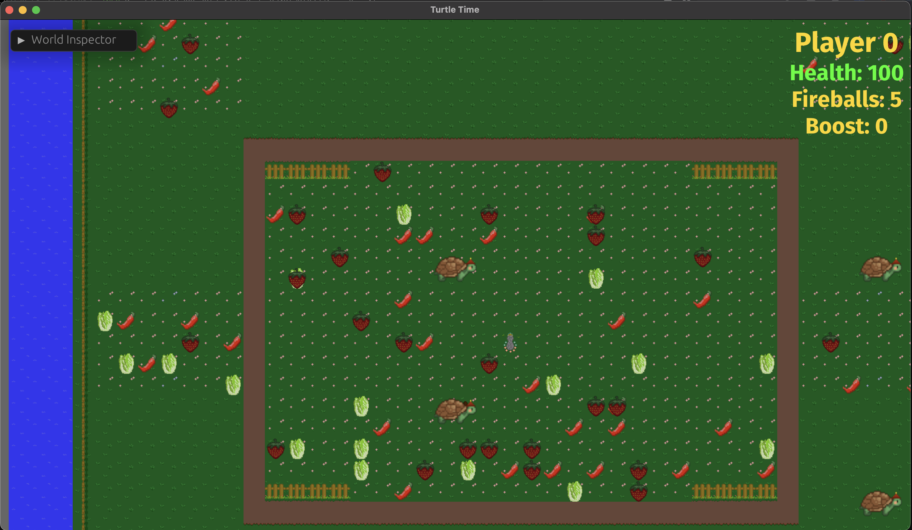

Turtle Time is my first attempt at game development. I discovered the [Bevy Engine](https://bevyengine.org/), which is written in [Rust](), and wanted to experiment a little and learn something new outside of my usual backend server programming work.

- [Template Repo](#template-repo)
- [Initial Gameplay Loop](#initial-gameplay-loop)
- [Adding Multiplayer](#adding-multiplayer)
  - [Converting single player systems to multiplayer.](#converting-single-player-systems-to-multiplayer)
  - [Player movement systems need to handle movement for __ALL__ players.](#player-movement-systems-need-to-handle-movement-for-all-players)
  - [Determinism - what does it mean?](#determinism---what-does-it-mean)
  - [Random spawns and how to agree on their randomness.](#random-spawns-and-how-to-agree-on-their-randomness)
  - [Ticking timers at a constant rate - game systems are FPS dependent.](#ticking-timers-at-a-constant-rate---game-systems-are-fps-dependent)


I started with and took inspiration from some of the Bevy tutorials on YouTube:

1. Logic Projects [Bevy 0.6-0.7 Intro Videos](https://youtube.com/playlist?list=PLT_D88-MTFOOh_S9YifHfo6KETvEmRmYh) series inspired the 2D game idea. ( [reference repo](https://github.com/mwbryant/rpg-bevy-tutorial) )
2. Logic Projects [Bevy Intro Tutorials](https://youtube.com/playlist?list=PLT_D88-MTFOPPl75g4WshL1Gx2bnGTUkz) series inspired a little more in-depth menu options and moving enemies and collision detection. ( [reference repo](https://github.com/mwbryant/bevy-tower-defense-tutorial) )
3. Johan Helsing's [Extreme Bevy](https://johanhelsing.studio/posts/extreme-bevy) blog series, which introduced me to [bevy_ggrs](https://github.com/gschup/bevy_ggrs) and [matchbox_server](https://github.com/johanhelsing/matchbox/tree/main/matchbox_server) for peer to peer networking and matchmaking in a battle type game. ( [reference repo](https://github.com/johanhelsing/extreme_bevy/tree/part-1) )
4. Jacques [Learn Bevy Engine 0.10 Beginner Tutorial Series](https://youtube.com/playlist?list=PLVnntJRoP85JHGX7rGDu6LaF3fmDDbqyd) which brought me up to speed on more movement, random entity spawns and UI using the more current Bevy `0.10`. ( [reference repo](https://github.com/frederickjjoubert/learn-bevy) )
5. NiklasEi's [bevy_game_template](https://github.com/NiklasEi/bevy_game_template) repo got me started with a decent framework with which to layer on my components and systems.

## Template Repo

The `bevy_game_template` repo is a really nice way to start a new Bevy `0.10` project. It comes with everything you need to get started on a new game and maybe some extras that you don't need right away but will come in handy later down the line. 

The things I really appreciated were the GitHub actions for building, testing and linting the project as well as the "deploy to GitHub pages" action that builds a web assembly (WASM) binary and deploys it to the `gh-pages` branch of your repo. Having a game that can be built and distributed via a website in around 12 minutes is invaluable for testing your work, especially on a multiplayer game that you don't want to force people to download and install for each iterative fix.

## Initial Gameplay Loop

Initially I started with quite a few concepts from `Logic Projects` Bevy intro videos for building an RPG type game. I used some of his examples to spawn a 2D arena, spawn a player, a camera to follow that player, movement controls so the player can move around and wall collision checks to keep the player inside the bounds of the basic arena.


## Adding Multiplayer

When searching around for Bevy tutorials I discovered an excellent dev blog series by [Johan Helsing](https://johanhelsing.studio/posts/extreme-bevy) in which he builds a p2p web game in rust with rollback netcode. This sounded very interesting to me, despite being totally over my head at the time. I wanted to try it out.

I followed some of his examples in the [extreme_bevy](https://github.com/johanhelsing/extreme_bevy/tree/part-1) repo to get started. After a little while I had all the pieces in place, but started running into traps for a newcomer when implementing multiplayer systems.

### Converting single player systems to multiplayer.

Most of my initial game was built around a single player - multiplayer games are much different.

First of all there was the problem of spawning multiple players and keeping track of which one is the "local" player. You need to know which player should be controlled by the local inputs and have the camera follow that person.

My initial camera follow system looked like this:
```rust
fn camera_follow(
    player_query: Query<&Transform, With<Player>>,
    mut camera_query: Query<&mut Transform, (Without<Player>, With<Camera2d>)>,
) {
    let player_transform = player_query.single();
    let mut camera_transform = camera_query.single_mut();

    camera_transform.translation.x = player_transform.translation.x;
    camera_transform.translation.y = player_transform.translation.y;
}
```

There are several problems to address when adapting this to a multiplayer game. First the `player_query.single()` line will `panic` if there is more than one player. Second, we have no way to know which player returned in that query is the local player.

In order to make this work I needed to add an optional `LocalHandle` resource to keep track of the local player handle. This can get inserted from 2 systems, either the "local" play `SyncTestSession` or in the online "lobby system" which adds all the peers to a `P2PSession` once they've all connected.


Local Sync Session:
```rust
fn create_synctest_session(commands: &mut Commands, num_players: usize) {
    let mut sess_build = SessionBuilder::<GGRSConfig>::new()
        .with_num_players(num_players)
        .with_max_prediction_window(MAX_PREDICTION)
        .with_fps(FPS)
        .expect("Invalid FPS")
        .with_input_delay(INPUT_DELAY)
        .with_check_distance(CHECK_DISTANCE);

    let mut peer_ids = Vec::new();
    for i in 0..num_players {
        sess_build = sess_build
            .add_player(PlayerType::Local, i)
            .expect("Could not add local player");
        peer_ids.push(PeerId(Uuid::new_v4()))
    }

    let sess = sess_build.start_synctest_session().expect("");

    commands.insert_resource(Session::SyncTestSession(sess));
    commands.insert_resource(LocalHandle(0)); // <-- Set local handle to 0
}
```

Updated camera follow system can now make use of the `LocalHandle` resource so the local user is centered on the screen at all times.

```rust
pub fn camera_follow(
    player_handle: Option<Res<LocalHandle>>, // <-- Use optional LocalHandle
    player_query: Query<(&Transform, &Player), Without<Fireball>>, // <-- Include Player in query results to compare to LocalHandle
    mut camera_query: Query<&mut Transform, (Without<Player>, With<Camera>)>,
) {
    let player_handle = match player_handle {
        Some(handle) => handle.0,
        None => return, // Session hasn't started yet
    };

    for (player_transform, player) in player_query.iter() {
        if player.handle != player_handle { // <-- Ensure we follow the local player
            continue;
        }

        let pos = player_transform.translation;

        for mut transform in camera_query.iter_mut() { // <-- There should only be 1 camera anyway
            transform.translation.x = pos.x;
            transform.translation.y = pos.y;
        }
    }
}
```

### Player movement systems need to handle movement for __ALL__ players.

Similar to the camera follow system, the player movement system needs to handle more than one player. This seems obvious at first, but its very easy to overlook a very simple problem when converting a single player movement system to a multiplayer system.

Working on the movement system is when something clicked for me; This type of multiplayer game, where only the player inputs are sent over the network, needs to be responsible for simulating ALL of the players in the game, not just the local player.

Initially, I had a naive movement system that attempted to return early if certain player conditions suggested that no work was to be done:

```rust
fn move_players(
    inputs: Res<PlayerInputs<GgrsConfig>>,
    mut player_query: Query<(&mut Player, &mut Transform, &mut TextureAtlasSprite)>,
    wall_query: Query<&Transform, (With<TileCollider>, Without<Player>)>,
) {
    for (mut player, mut transform, mut sprite) in player_query.iter_mut() {
        player.just_moved = false;

        if !player.active {
            return; // <-- This is problematic, we need to continue instead.
        }
        
        // ...

    }
}
```

This issue took me longer than I would like to admit to resolve. I reached out to Johan Helsing on his [Discord server](https://discord.gg/hP39naaq) and got some great pointers but ultimately it took me staring at this code for a while to realize my mistake - I just needed to `continue` instead of `returning`. 🤦

### Determinism - what does it mean?

Building on the "aha moment" I had in the movement system, I soon realized that the game had to behave __exactly__ the same on all clients in order to keep in sync. I had seen people talk about determinism but honestly didn't fully understand it until now. 

The game has to be as close to 100% deterministic as possible in order for all simulated possibilities to end in the same result on all clients. 

What exactly does this mean for a fresh game dev?

If there is some game entity that can have an affect on a player, a pickup that increases player speed for example, that entity has to spawn at the same time, at the same location and have the same effect on speed on all of the clients. 

This really started to sync-in now that I was spawning random edibles in my game. If a strawberry spawned on 1 screen just a few frames before it spawned on another screen, a player that picked it up would immediately be desynced from their peers.


*my wife also supplied me with upgraded textures :D*

### Random spawns and how to agree on their randomness.

In order to get randomly spawning entities to spawn at the same locations on each client, all clients need to agree on how to randomly place them. I once again took to the Johan Helsing Discord server to ask folks, who are much smarter than myself, how they would approach such a thing. I got a response from `ThierryBerger#8164` who suggested that each client could send their own part of the seed and the client could combine them all to compute the final seed. 

I came up with a `AgreedRandom` resource that used the matchbox peer ID's as input to a computed hash that would then be used as the RNG seed.

`resources.rs`
```rust
#[derive(Resource)]
pub struct AgreedRandom {
    pub rng: StdRng,
}

impl AgreedRandom {
    pub fn new(peers: Vec<PeerId>) -> AgreedRandom {
        let mut tmp = peers.clone();
        tmp.sort();
        let seed = tmp.iter().fold(String::new(), |mut a, b| {
            a.reserve(b.0.to_string().len() + 1);
            a.push_str(b.0.to_string().as_str());
            a.push_str(" ");
            a.trim_end().to_string()
        });
        let rng: StdRng = Seeder::from(seed).make_rng();

        AgreedRandom { rng }
    }
}
```

`lobby.rs`
```rust
fn lobby_system(
    mut commands: Commands,
    mut socket: ResMut<MatchboxSocket<SingleChannel>>,
){ // abbreviated for example
    // ...

    // set final player list
    let players = socket.players();

    let mut peers = Vec::new();
    for p in players.clone() {
        match p {
            PlayerType::Remote(id) => peers.push(id),
            PlayerType::Spectator(id) => peers.push(id),
            PlayerType::Local => (), // local player id retrieved below
        }
    }
    // if we made it here we should have a local peer ID
    match socket.id() {
        Some(id) => peers.push(id),
        None => (), // TODO: something more reliable
    };
    
    commands.insert_resource(AgreedRandom::new(peers));

    // ...
}
```

This could then be used when picking a location on the map to spawn entities. If done with the right timing, this will place entities in a deterministic fashion, on each clients screen. 

`systems.rs`
```rust
pub fn spawn_strawberry_over_time(
    mut commands: Commands,
    mut agreed_seed: ResMut<AgreedRandom>,
    mut rip: ResMut<RollbackIdProvider>,
    asset_server: Res<TextureAssets>,
    timer: Res<EdibleSpawnTimer>,
    spawner_query: Query<&Transform, With<EncounterSpawner>>,
) {
    if timer.strawberry_timer.finished() {
        let spawn_area: Vec<&Transform> = spawner_query.iter().collect();

        // pick a random spawn location from spawner transforms
        let idx = agreed_seed.rng.gen_range(0..spawn_area.len());
        let pos = spawn_area[idx];

        commands.spawn((
            Name::new("Strawberry"),
            Strawberry {},
            RoundComponent {},
            SpriteBundle {
                transform: Transform::from_xyz(pos.translation.x, pos.translation.y, 1.0),
                texture: asset_server.texture_strawberry.clone(),
                ..Default::default()
            },
            rip.next(),
        ));
    }
}
```

Johan noted that using matchbox peer ID's works well enough, but there are probably better ways to do this if you need to debug the resulting RNG. For my use, I really only needed to confirm that the concatenated peer ID string going into the seeder, was always in the same order.

### Ticking timers at a constant rate - game systems are FPS dependent.

There are timers involved in when to spawn and despawn entities. For a multiplayer game that relies on consistent and exact simulations to occur on each players computer, you have to start, stop and increment these timers in a deterministic way.

At first I was focused on *when* to place the `EdibleSpawnTimer` resource into the world. I figured if I could start the timer at the same instant on all clients, perhaps the edibles would spawn in sync and therefore players would behave consistently.

The problem wasn't when to spawn and start the timer though, it was when and how to tick the timers. I was ticking them using the Bevy provided `Time` resource and passing a `time.delta()` to my tickers. The problem with this approach is twofold:
1. The time between each frame returned from `time.delta(0)` is dependant on frame rate.
2. The system doing the ticking can be run at different times on each client.

This meant that each client would almost instantly become out of sync no matter when spawn or start ticking the timers.

The solution, again suggested by Johan - tick the timers using a fixed duration, as part of the `GGRSSchedule` rollback system and register the timer as a rollback resource. Which looked like this:

`main.rs`
```rust
fn main() {
    let mut app = App::new();

    GGRSPlugin::<GGRSConfig>::new()
        .with_update_frequency(FPS)
        .with_input_system(input)
        // ...
        .register_rollback_resource::<EdibleSpawnTimer>()
        .build(&mut app);
}
```

`resources.rs`
```rust
#[derive(Resource, Reflect)]
#[reflect(Resource)]
pub struct EdibleSpawnTimer {
    pub chili_pepper_timer: Timer,
    pub strawberry_timer: Timer,
    pub lettuce_timer: Timer,
}
```

`systems.rs`
```rust
pub fn tick_edible_timer(mut edible_spawn_timer: ResMut<EdibleSpawnTimer>) {
    // use fixed duration tick delta to keep in sync with GGRSSchedule
    let fixed_tick = (1000 / FPS) as u64;

    edible_spawn_timer
        .chili_pepper_timer
        .tick(Duration::from_millis(fixed_tick));
    edible_spawn_timer
        .strawberry_timer
        .tick(Duration::from_millis(fixed_tick));
    edible_spawn_timer
        .lettuce_timer
        .tick(Duration::from_millis(fixed_tick));
}
```

With the timers ticking at the same, fixed duration, all players could now see edibles spawning in at the exact (or very close to it) instant. I could debug the timer and see it ticking at the same intervals by eye but haven't attempted to check it programmatically. In a future update I will be adding a debug console to check network stats and world checksums to help confirm things are staying in sync.

I think this post is getting kind of long now, so I will save the following topics for the next post:

* Tearing down peer-to-peer sessions without panic.
* Multiple game state states, how to control flow and run conditions.
* Despawning SyncTestSession rollback components.


